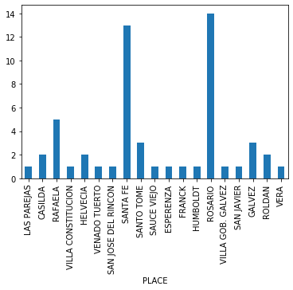

# Santa Fe COVID API

Based on handed scraped data on goverment reports: https://docs.google.com/spreadsheets/d/19aa5sqdsj3nYmBqllPXvgj72cvx63SzB2Hx8B02vMwU
All the time series are cumulatives (not new reported cases). 'Sospechosos' could decrease because some ca

# Non-Python users

For non python users <code>Confirmados_{DATE}.csv</code> <code>Sospechosos_{DATE}.csv</code> <code>Descartados_{DATE}.csv</code> <code>Info_{DATE}.csv </code> are generated periodically to be read.


## API

Python API for working with Santa Fe (Argentina) COVID data reported.

DataTypes exported:
- CityInfo, COVIDStats namedtuples
- SantaFeAPI class

API methods:
- api.get_stats(date)
- api.get_cities_stats(date)
- api.get_departments_stats(date)
API public properties:
- api.df_info : pandas.DataFrame
- api.df_confirmados : pandas.DataFrame
- api.df_descartados : pandas.DataFrame
- api.df_sospechosos : pandas.DataFrame
- api.city_information : Dict[CityName, CityInfo]
    
Exported functions:
- is_city(str)
- is_deparment(str)
- normalize_str(str)

### Important data types.


```python
from santa_fe_api import *
print('CityInfo namedtuple:', CityInfo._fields)
print('COVIDStats namedtuple:', COVIDStats._fields)
```

    CityInfo namedtuple: ('latitud', 'longitud', 'departamento')
    COVIDStats namedtuple: ('date', 'place_name', 'confirmados', 'descartados', 'sospechosos')


## Create api instance passing the working directory 
When load the data the API tells if there are no entries in 'Info' sheet for certain city.


```python
api = SantaFeAPI('./', strict_sanity = False)
```

    Download from google drive...
    Not info entry for: LAS TOSCAS
    Not info entry for: DESVIO ARIJON
    Not info entry for: CALCHAQUI
    Not info entry for: LAS TOSCAS
    Not info entry for: DESVIO ARIJON
    Not info entry for: CALCHAQUI
    Not info entry for: LAS TOSCAS
    Not info entry for: DESVIO ARIJON
    Not info entry for: CALCHAQUI


### <code>get_stats : Date -> [ COVIDStats ]</code> of all places


```python
api.get_stats('26/3/2020')[:3]
```


    [COVIDStats(date='26/3/2020', place_name='VENADO TUERTO', confirmados=1.0, descartados=3.0, sospechosos=2.0),
     COVIDStats(date='26/3/2020', place_name='CARMEN', confirmados=0.0, descartados=0.0, sospechosos=1.0),
     COVIDStats(date='26/3/2020', place_name='RUFINO', confirmados=0.0, descartados=1.0, sospechosos=0.0)]


### <code>get_stats : Date -> [ COVIDStats ]</code> of only cities


```python
api.get_cities_stats('26/3/2020')[:3]
```


    [COVIDStats(date='26/3/2020', place_name='VENADO TUERTO', confirmados=1.0, descartados=3.0, sospechosos=2.0),
     COVIDStats(date='26/3/2020', place_name='CARMEN', confirmados=0.0, descartados=0.0, sospechosos=1.0),
     COVIDStats(date='26/3/2020', place_name='RUFINO', confirmados=0.0, descartados=1.0, sospechosos=0.0)]


### <code>get_stats : Date -> [ COVIDStats ]</code> of only departments


```python
api.get_departments_stats('26/3/2020')[:10]
```


    ---------------------------------------------------------------------------

    NotImplementedError                       Traceback (most recent call last)

    <ipython-input-57-dfabae7695bd> in <module>
    ----> 1 api.get_departments_stats('26/3/2020')[:10]
    

    ~/Escritorio/corona/map/santafecovidapi/santa_fe_api.py in get_departments_stats(self, date)
         93     def get_departments_stats(self,date):
         94         """ Return a [ COVIDStats ] for the deparments only. """
    ---> 95         raise NotImplementedError
         96         return [ s  for s in self.get_stats(date) if is_deparment(s.place_name) ]
         97 


    NotImplementedError: 


### Exported DataFrames
Also exports 3 pandas.DataFrame <code>df_confirmados, df_descartados, df_sospechosos</code>.

With the content of Google Drive base 'Confirmados', 'Descartados', 'Sospechos'.

Values are cumulative. City names are normalized using normalize_str function.


```python
api.df_confirmados.head(3)
```


<div>
<style scoped>
    .dataframe tbody tr th:only-of-type {
        vertical-align: middle;
    }

    .dataframe tbody tr th {
        vertical-align: top;
    }

    .dataframe thead th {
        text-align: right;
    }
</style>
<table border="1" class="dataframe">
  <thead>
    <tr style="text-align: right;">
      <th></th>
      <th>14/03</th>
      <th>15/03</th>
      <th>16/03</th>
      <th>17/3 18:00</th>
      <th>18/3 18:00</th>
      <th>19/03</th>
      <th>20/03</th>
      <th>21/03</th>
      <th>22/03</th>
      <th>23/3/2020</th>
      <th>24/3/2020</th>
      <th>25/3/2020</th>
      <th>26/3/2020</th>
      <th>27/3/2020</th>
      <th>28/3/2020</th>
    </tr>
    <tr>
      <th>PLACE</th>
      <th></th>
      <th></th>
      <th></th>
      <th></th>
      <th></th>
      <th></th>
      <th></th>
      <th></th>
      <th></th>
      <th></th>
      <th></th>
      <th></th>
      <th></th>
      <th></th>
      <th></th>
    </tr>
  </thead>
  <tbody>
    <tr>
      <th>TOTAL</th>
      <td>0.0</td>
      <td>1.0</td>
      <td>0.0</td>
      <td>0.0</td>
      <td>0.0</td>
      <td>0.0</td>
      <td>0.0</td>
      <td>0.0</td>
      <td>0.0</td>
      <td>15.0</td>
      <td>20.0</td>
      <td>39.0</td>
      <td>55.0</td>
      <td>64.0</td>
      <td>77.0</td>
    </tr>
    <tr>
      <th>D_BELGRANO</th>
      <td>0.0</td>
      <td>0.0</td>
      <td>0.0</td>
      <td>0.0</td>
      <td>0.0</td>
      <td>0.0</td>
      <td>0.0</td>
      <td>0.0</td>
      <td>0.0</td>
      <td>0.0</td>
      <td>0.0</td>
      <td>0.0</td>
      <td>0.0</td>
      <td>0.0</td>
      <td>0.0</td>
    </tr>
    <tr>
      <th>ARMSTRONG</th>
      <td>0.0</td>
      <td>0.0</td>
      <td>0.0</td>
      <td>0.0</td>
      <td>0.0</td>
      <td>0.0</td>
      <td>0.0</td>
      <td>0.0</td>
      <td>0.0</td>
      <td>0.0</td>
      <td>0.0</td>
      <td>0.0</td>
      <td>0.0</td>
      <td>0.0</td>
      <td>0.0</td>
    </tr>
  </tbody>
</table>
</div>


```python
api.df_descartados.head(3)
```


<div>
<style scoped>
    .dataframe tbody tr th:only-of-type {
        vertical-align: middle;
    }

    .dataframe tbody tr th {
        vertical-align: top;
    }

    .dataframe thead th {
        text-align: right;
    }
</style>
<table border="1" class="dataframe">
  <thead>
    <tr style="text-align: right;">
      <th></th>
      <th>14/03</th>
      <th>15/03</th>
      <th>16/03</th>
      <th>17/3/2020</th>
      <th>18/3/2020</th>
      <th>19/03</th>
      <th>20/03</th>
      <th>21/03</th>
      <th>22/03</th>
      <th>23/3/2020</th>
      <th>24/3/2020</th>
      <th>25/3/2020</th>
      <th>26/3/2020</th>
      <th>27/3/2020</th>
      <th>28/3/2020</th>
    </tr>
    <tr>
      <th>PLACE</th>
      <th></th>
      <th></th>
      <th></th>
      <th></th>
      <th></th>
      <th></th>
      <th></th>
      <th></th>
      <th></th>
      <th></th>
      <th></th>
      <th></th>
      <th></th>
      <th></th>
      <th></th>
    </tr>
  </thead>
  <tbody>
    <tr>
      <th>TOTAL</th>
      <td>18.0</td>
      <td>21.0</td>
      <td>22.0</td>
      <td>25.0</td>
      <td>28.0</td>
      <td>0.0</td>
      <td>0.0</td>
      <td>0.0</td>
      <td>0.0</td>
      <td>64.0</td>
      <td>95.0</td>
      <td>120.0</td>
      <td>161.0</td>
      <td>214.0</td>
      <td>280.0</td>
    </tr>
    <tr>
      <th>BELGRANO</th>
      <td>0.0</td>
      <td>0.0</td>
      <td>0.0</td>
      <td>0.0</td>
      <td>0.0</td>
      <td>0.0</td>
      <td>0.0</td>
      <td>0.0</td>
      <td>0.0</td>
      <td>0.0</td>
      <td>0.0</td>
      <td>0.0</td>
      <td>0.0</td>
      <td>0.0</td>
      <td>0.0</td>
    </tr>
    <tr>
      <th>ARMSTRONG</th>
      <td>0.0</td>
      <td>0.0</td>
      <td>0.0</td>
      <td>0.0</td>
      <td>0.0</td>
      <td>0.0</td>
      <td>0.0</td>
      <td>0.0</td>
      <td>0.0</td>
      <td>0.0</td>
      <td>1.0</td>
      <td>1.0</td>
      <td>1.0</td>
      <td>1.0</td>
      <td>1.0</td>
    </tr>
  </tbody>
</table>
</div>


```python
api.df_sospechosos.head(3)
```


<div>
<style scoped>
    .dataframe tbody tr th:only-of-type {
        vertical-align: middle;
    }

    .dataframe tbody tr th {
        vertical-align: top;
    }

    .dataframe thead th {
        text-align: right;
    }
</style>
<table border="1" class="dataframe">
  <thead>
    <tr style="text-align: right;">
      <th></th>
      <th>14/03</th>
      <th>15/03</th>
      <th>16/03</th>
      <th>17/3/2020</th>
      <th>18/3/2020</th>
      <th>19/03</th>
      <th>20/03</th>
      <th>21/03</th>
      <th>22/03</th>
      <th>23/3/2020</th>
      <th>24/3/2020</th>
      <th>25/3/2020</th>
      <th>26/3/2020</th>
      <th>27/3/2020</th>
      <th>28/3/2020</th>
    </tr>
    <tr>
      <th>PLACE</th>
      <th></th>
      <th></th>
      <th></th>
      <th></th>
      <th></th>
      <th></th>
      <th></th>
      <th></th>
      <th></th>
      <th></th>
      <th></th>
      <th></th>
      <th></th>
      <th></th>
      <th></th>
    </tr>
  </thead>
  <tbody>
    <tr>
      <th>TOTAL</th>
      <td>6.0</td>
      <td>10.0</td>
      <td>14.0</td>
      <td>20.0</td>
      <td>0.0</td>
      <td>0.0</td>
      <td>0.0</td>
      <td>0.0</td>
      <td>0.0</td>
      <td>89.0</td>
      <td>70.0</td>
      <td>72.0</td>
      <td>89.0</td>
      <td>105.0</td>
      <td>87.0</td>
    </tr>
    <tr>
      <th>BELGRANO</th>
      <td>0.0</td>
      <td>0.0</td>
      <td>0.0</td>
      <td>0.0</td>
      <td>0.0</td>
      <td>0.0</td>
      <td>0.0</td>
      <td>0.0</td>
      <td>0.0</td>
      <td>0.0</td>
      <td>0.0</td>
      <td>0.0</td>
      <td>0.0</td>
      <td>0.0</td>
      <td>0.0</td>
    </tr>
    <tr>
      <th>ARMSTRONG</th>
      <td>0.0</td>
      <td>0.0</td>
      <td>0.0</td>
      <td>0.0</td>
      <td>0.0</td>
      <td>0.0</td>
      <td>0.0</td>
      <td>0.0</td>
      <td>0.0</td>
      <td>0.0</td>
      <td>0.0</td>
      <td>0.0</td>
      <td>0.0</td>
      <td>0.0</td>
      <td>0.0</td>
    </tr>
  </tbody>
</table>
</div>


API exports a DataFrame with 'Info' sheet (information about each city).


```python
api.df_info.head(3)
```


<div>
<style scoped>
    .dataframe tbody tr th:only-of-type {
        vertical-align: middle;
    }

    .dataframe tbody tr th {
        vertical-align: top;
    }

    .dataframe thead th {
        text-align: right;
    }
</style>
<table border="1" class="dataframe">
  <thead>
    <tr style="text-align: right;">
      <th></th>
      <th>LATITUD</th>
      <th>LONGITUD</th>
      <th>DEPARTAMENTO</th>
    </tr>
    <tr>
      <th>PLACE</th>
      <th></th>
      <th></th>
      <th></th>
    </tr>
  </thead>
  <tbody>
    <tr>
      <th>VENADO TUERTO</th>
      <td>-33.742717</td>
      <td>-61.968892</td>
      <td>0.0</td>
    </tr>
    <tr>
      <th>CARMEN</th>
      <td>-33.732215</td>
      <td>-61.761412</td>
      <td>0.0</td>
    </tr>
    <tr>
      <th>RUFINO</th>
      <td>-34.264474</td>
      <td>-62.711107</td>
      <td>0.0</td>
    </tr>
  </tbody>
</table>
</div>


API exports a <code>Dict[CityName, CityInfo]</code>


```python
list(api.city_information.items())[:3]
```


    [('VENADO TUERTO',
      CityInfo(latitud=-33.742717, longitud=-61.968892000000004, departamento=0.0)),
     ('CARMEN',
      CityInfo(latitud=-33.732215000000004, longitud=-61.761412, departamento=0.0)),
     ('RUFINO',
      CityInfo(latitud=-34.264474, longitud=-62.711107, departamento=0.0))]


Uses <code>is_city(str)</code> <code>is_deparment(str)</code> method to check if a place name is city or deparment.


```python
ciudades = api.df_confirmados[ api.df_confirmados.index.map(is_city)  ]['26/3/2020']
ciudades = ciudades[ciudades>0]
ciudades.plot.bar()
```


    <matplotlib.axes._subplots.AxesSubplot at 0x7f08ad80a040>




