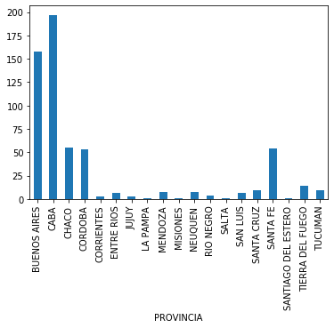
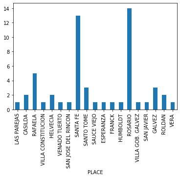

# Argentina and Santa Fe COVID API

Based on handed scraped data on goverment reports:
- Argentina: https://docs.google.com/spreadsheets/d/e/2PACX-1vTfinng5SDBH9RSJMHJk28dUlW3VVSuvqaBSGzU-fYRTVLCzOkw1MnY17L2tWsSOppHB96fr21Ykbyv/pub#
- Santa Fe: https://docs.google.com/spreadsheets/d/19aa5sqdsj3nYmBqllPXvgj72cvx63SzB2Hx8B02vMwU

Santa Fe reports are cumulative. National reports shows new daily cases.

We decided to work with cumulatives time series. There is a smart design decision behind that: if we have cumulative confirmed cases, we don't have to read all the entries, only with the frequentcy we are interested in (imagine weekly analysis).

'Sospechosos' could decrease because some cases can move to 'Confirmados' o 'Descartados'.

# Non-Python users

For non python users csv's are generated periodically to be parsed and used (see <code>./csv/</code>) folder. All with cumulative time series.
- For Santa Fe:

<code>csv/SantaFe_AllData.csv</code>

- For Argentina:

<code>csv/Argentina_Provinces.csv</code>

Check last update time on <code>csv/last_update.txt</code>


## Argentina API

Python API for working with Argentina COVID data reported.

DataTypes exported:
- COVIDStats namedtuple
- ArgentinaAPI class

API methods:
- api.get_stats(date)
API public properties:
- api.df_provinces : pandas.DataFrame
- api.provinces : List[str]

### Important data types.


```python
from argentina_api import *
print('COVIDStats namedtuple:', COVIDStats._fields)
```

    COVIDStats namedtuple: ('date', 'place_name', 'confirmados', 'muertos', 'recuperados', 'activos')


## Create api instance passing the working directory 
When load the data the API tells if there are no entries in 'Info' sheet for certain city.


```python
api = ArgentinaAPI('./')
```

    Downloading Argentinian provinces table from google drive (https://docs.google.com/spreadsheets/d/e/2PACX-1vTfinng5SDBH9RSJMHJk28dUlW3VVSuvqaBSGzU-fYRTVLCzOkw1MnY17L2tWsSOppHB96fr21Ykbyv/pub#)


### <code>get_stats : Date -> [ COVIDStats ]</code> of all provinces
Date must be expressd in DD/MM format.


```python
api.get_stats('26/03')[:3]
```


    [COVIDStats(date='26/03', place_name='BUENOS AIRES', confirmados=158, muertos=4, recuperados=15, activos=139),
     COVIDStats(date='26/03', place_name='CABA', confirmados=197, muertos=4, recuperados=53, activos=140),
     COVIDStats(date='26/03', place_name='CATAMARCA', confirmados=0, muertos=0, recuperados=0, activos=0)]


### Exported DataFrames
Also exports a DataFrame <code>df_provinces</code>.

With the content of Google Drive data by province (see link above). Provinces names are normalized using normalize_str function.


```python
api.df_provinces.head(3)
```


<div>
<style scoped>
    .dataframe tbody tr th:only-of-type {
        vertical-align: middle;
    }

    .dataframe tbody tr th {
        vertical-align: top;
    }

    .dataframe thead th {
        text-align: right;
    }
</style>
<table border="1" class="dataframe">
  <thead>
    <tr style="text-align: right;">
      <th></th>
      <th></th>
      <th>03/03</th>
      <th>04/03</th>
      <th>05/03</th>
      <th>06/03</th>
      <th>07/03</th>
      <th>08/03</th>
      <th>09/03</th>
      <th>10/03</th>
      <th>11/03</th>
      <th>12/03</th>
      <th>...</th>
      <th>02/04</th>
      <th>03/04</th>
      <th>04/04</th>
      <th>05/04</th>
      <th>06/04</th>
      <th>07/04</th>
      <th>08/04</th>
      <th>09/04</th>
      <th>10/04</th>
      <th>11/04</th>
    </tr>
    <tr>
      <th>TYPE</th>
      <th>PROVINCIA</th>
      <th></th>
      <th></th>
      <th></th>
      <th></th>
      <th></th>
      <th></th>
      <th></th>
      <th></th>
      <th></th>
      <th></th>
      <th></th>
      <th></th>
      <th></th>
      <th></th>
      <th></th>
      <th></th>
      <th></th>
      <th></th>
      <th></th>
      <th></th>
      <th></th>
    </tr>
  </thead>
  <tbody>
    <tr>
      <th rowspan="3" valign="top">ACTIVOS</th>
      <th>BUENOS AIRES</th>
      <td>0</td>
      <td>0</td>
      <td>1</td>
      <td>2</td>
      <td>2</td>
      <td>3</td>
      <td>3</td>
      <td>4</td>
      <td>5</td>
      <td>9</td>
      <td>...</td>
      <td>289</td>
      <td>308</td>
      <td>333</td>
      <td>365</td>
      <td>375</td>
      <td>405</td>
      <td>421</td>
      <td>442</td>
      <td>460</td>
      <td>493</td>
    </tr>
    <tr>
      <th>CABA</th>
      <td>1</td>
      <td>1</td>
      <td>1</td>
      <td>5</td>
      <td>5</td>
      <td>7</td>
      <td>8</td>
      <td>9</td>
      <td>10</td>
      <td>13</td>
      <td>...</td>
      <td>283</td>
      <td>311</td>
      <td>345</td>
      <td>376</td>
      <td>389</td>
      <td>411</td>
      <td>427</td>
      <td>445</td>
      <td>455</td>
      <td>498</td>
    </tr>
    <tr>
      <th>CATAMARCA</th>
      <td>0</td>
      <td>0</td>
      <td>0</td>
      <td>0</td>
      <td>0</td>
      <td>0</td>
      <td>0</td>
      <td>0</td>
      <td>0</td>
      <td>0</td>
      <td>...</td>
      <td>0</td>
      <td>0</td>
      <td>0</td>
      <td>0</td>
      <td>0</td>
      <td>0</td>
      <td>0</td>
      <td>0</td>
      <td>0</td>
      <td>0</td>
    </tr>
  </tbody>
</table>
<p>3 rows × 40 columns</p>
</div>


### Exported provinces names
Also exports a List[str] <code>provinces</code> with all the provinces names:


```python
api.provinces
```


    ['BUENOS AIRES',
     'CABA',
     'CATAMARCA',
     'CHACO',
     'CHUBUT',
     'CORDOBA',
     'CORRIENTES',
     'ENTRE RIOS',
     'FORMOSA',
     'JUJUY',
     'LA PAMPA',
     'LA RIOJA',
     'MENDOZA',
     'MISIONES',
     'NEUQUEN',
     'RIO NEGRO',
     'SALTA',
     'SAN JUAN',
     'SAN LUIS',
     'SANTA CRUZ',
     'SANTA FE',
     'SANTIAGO DEL ESTERO',
     'TIERRA DEL FUEGO',
     'TUCUMAN']


### Example of use


```python
provinces = api.df_provinces.loc['CONFIRMADOS']['26/03']
provinces = provinces[provinces>0]
provinces.plot.bar()
```


    <matplotlib.axes._subplots.AxesSubplot at 0x7fce3ff5e280>





## Santa Fe API

Python API for working with Santa Fe (Argentina) COVID data reported.

DataTypes exported:
- CityInfo, COVIDStats namedtuples
- SantaFeAPI class

API methods:
- api.get_stats(date)
- api.get_cities_stats(date)
- api.get_departments_stats(date)
API public properties:
- api.df : pandas.DataFrame
- api.all_names : List[str]
- api.cities : List[str]
- api.departments : List[str]
    
Exported functions:
- is_city(str)
- is_deparment(str)
- normalize_str(str)

### Important data types.


```python
from santa_fe_api import *
print('COVIDStats namedtuple:', COVIDStats._fields)
```

    COVIDStats namedtuple: ('date', 'place_name', 'confirmados', 'descartados', 'sospechosos')


## Create api instance passing the working directory 
When load the data the API tells if there are no entries in 'Info' sheet for certain city.


```python
api = SantaFeAPI('./')
```

    Download from google drive...


### <code>get_stats : Date -> [ COVIDStats ]</code> of all places
Date must be expressd in DD/M/YYYY format.


```python
api.get_stats('26/3/2020')[:3]
```


    [COVIDStats(date='26/3/2020', place_name='#D_IRIONDO', confirmados=0.0, descartados=1.0, sospechosos=0.0),
     COVIDStats(date='26/3/2020', place_name='ARMSTRONG', confirmados=0.0, descartados=1.0, sospechosos=0.0),
     COVIDStats(date='26/3/2020', place_name='RAFAELA', confirmados=5.0, descartados=1.0, sospechosos=9.0)]


### <code>get_stats : Date -> [ COVIDStats ]</code> of only cities


```python
api.get_cities_stats('26/3/2020')[:3]
```


    [COVIDStats(date='26/3/2020', place_name='ARMSTRONG', confirmados=0.0, descartados=1.0, sospechosos=0.0),
     COVIDStats(date='26/3/2020', place_name='RAFAELA', confirmados=5.0, descartados=1.0, sospechosos=9.0),
     COVIDStats(date='26/3/2020', place_name='SAN GENARO', confirmados=0.0, descartados=0.0, sospechosos=1.0)]


### <code>get_stats : Date -> [ COVIDStats ]</code> of only departments


```python
api.get_departments_stats('26/3/2020')[:10]
```


    [COVIDStats(date='26/3/2020', place_name='#D_IRIONDO', confirmados=0.0, descartados=1.0, sospechosos=0.0),
     COVIDStats(date='26/3/2020', place_name='#D_GENERAL LOPEZ', confirmados=1.0, descartados=5.0, sospechosos=4.0),
     COVIDStats(date='26/3/2020', place_name='#D_SAN CRISTOBAL', confirmados=0.0, descartados=1.0, sospechosos=1.0),
     COVIDStats(date='26/3/2020', place_name='#D_GARAY', confirmados=2.0, descartados=2.0, sospechosos=5.0),
     COVIDStats(date='26/3/2020', place_name='#D_GENERAL OBLIGADO', confirmados=0.0, descartados=2.0, sospechosos=5.0),
     COVIDStats(date='26/3/2020', place_name='#D_SAN JUSTO', confirmados=0.0, descartados=0.0, sospechosos=2.0),
     COVIDStats(date='26/3/2020', place_name='#D_ROSARIO', confirmados=15.0, descartados=88.0, sospechosos=22.0),
     COVIDStats(date='26/3/2020', place_name='#D_CASTELLANOS', confirmados=5.0, descartados=4.0, sospechosos=11.0),
     COVIDStats(date='26/3/2020', place_name='#D_CASEROS', confirmados=2.0, descartados=0.0, sospechosos=1.0),
     COVIDStats(date='26/3/2020', place_name='#D_CONSTITUCION', confirmados=1.0, descartados=3.0, sospechosos=1.0)]


### Exported DataFrames
Also exports a pandas.DataFrame <code>df</code>.

With the content of Google Drive 'AllData' with <code>['TYPE','DEPARTMENT','PLACE']</code> index.

Values are cumulative. City names are normalized using normalize_str function.


```python
api.df.head(3)
```


<div>
<style scoped>
    .dataframe tbody tr th:only-of-type {
        vertical-align: middle;
    }

    .dataframe tbody tr th {
        vertical-align: top;
    }

    .dataframe thead th {
        text-align: right;
    }
</style>
<table border="1" class="dataframe">
  <thead>
    <tr style="text-align: right;">
      <th></th>
      <th></th>
      <th></th>
      <th>14/3/2020</th>
      <th>15/3/2020</th>
      <th>16/3/2020</th>
      <th>17/3/2020</th>
      <th>18/3/2020</th>
      <th>19/3/2020</th>
      <th>20/3/2020</th>
      <th>21/3/2020</th>
      <th>22/3/2020</th>
      <th>23/3/2020</th>
      <th>...</th>
      <th>31/3/2020</th>
      <th>1/4/2020</th>
      <th>2/4/2020</th>
      <th>3/4/2020</th>
      <th>4/4/2020</th>
      <th>5/4/2020</th>
      <th>6/4/2020</th>
      <th>7/4/2020</th>
      <th>8/4/2020</th>
      <th>9/4/2020</th>
    </tr>
    <tr>
      <th>TYPE</th>
      <th>DEPARTMENT</th>
      <th>PLACE</th>
      <th></th>
      <th></th>
      <th></th>
      <th></th>
      <th></th>
      <th></th>
      <th></th>
      <th></th>
      <th></th>
      <th></th>
      <th></th>
      <th></th>
      <th></th>
      <th></th>
      <th></th>
      <th></th>
      <th></th>
      <th></th>
      <th></th>
      <th></th>
      <th></th>
    </tr>
  </thead>
  <tbody>
    <tr>
      <th rowspan="3" valign="top">CONFIRMADOS</th>
      <th>##TOTAL</th>
      <th>##TOTAL</th>
      <td>1.0</td>
      <td>1.0</td>
      <td>1.0</td>
      <td>1.0</td>
      <td>1.0</td>
      <td>2.0</td>
      <td>2.0</td>
      <td>4.0</td>
      <td>4.0</td>
      <td>15.0</td>
      <td>...</td>
      <td>133.0</td>
      <td>144.0</td>
      <td>152.0</td>
      <td>160.0</td>
      <td>165.0</td>
      <td>176.0</td>
      <td>184.0</td>
      <td>187.0</td>
      <td>189.0</td>
      <td>195.0</td>
    </tr>
    <tr>
      <th rowspan="2" valign="top">#D_9 DE JULIO</th>
      <th>#D_9 DE JULIO</th>
      <td>0.0</td>
      <td>0.0</td>
      <td>0.0</td>
      <td>0.0</td>
      <td>0.0</td>
      <td>0.0</td>
      <td>0.0</td>
      <td>0.0</td>
      <td>0.0</td>
      <td>0.0</td>
      <td>...</td>
      <td>0.0</td>
      <td>0.0</td>
      <td>0.0</td>
      <td>0.0</td>
      <td>0.0</td>
      <td>0.0</td>
      <td>0.0</td>
      <td>0.0</td>
      <td>0.0</td>
      <td>0.0</td>
    </tr>
    <tr>
      <th>TOSTADO</th>
      <td>0.0</td>
      <td>0.0</td>
      <td>0.0</td>
      <td>0.0</td>
      <td>0.0</td>
      <td>0.0</td>
      <td>0.0</td>
      <td>0.0</td>
      <td>0.0</td>
      <td>0.0</td>
      <td>...</td>
      <td>0.0</td>
      <td>0.0</td>
      <td>0.0</td>
      <td>0.0</td>
      <td>0.0</td>
      <td>0.0</td>
      <td>0.0</td>
      <td>0.0</td>
      <td>0.0</td>
      <td>0.0</td>
    </tr>
  </tbody>
</table>
<p>3 rows × 27 columns</p>
</div>


### Exported Dict[CityName, DepartmentName]
<code>to_department(str)</code> property stores CityName to DepartmentName assignations.
<code>all_names</code> property stores Set[CityName or DepartmentName].
<code>cities</code> property stores Set[CityName].
<code>departments</code> property stores Set[DepartmentName].


```python
print('Some cities: {}'.format(list(api.cities)[:3]))
print('Some departments: {}'.format(list(api.departments)[:3]))
print('Cities with the respective departments: {}'.format([(c,api.to_department[c]) for c in list(api.cities)[:2]]))
```

    Some cities: ['ARMSTRONG', 'RAFAELA', 'SAN GENARO']
    Some departments: ['#D_IRIONDO', '#D_CONSTITUCION', '#D_GENERAL OBLIGADO']
    Cities with the respective departments: [('ARMSTRONG', '#D_BELGRANO'), ('RAFAELA', '#D_CASTELLANOS')]


### Example of use

Uses <code>is_city(str)</code> <code>is_deparment(str)</code> method to check if a place name is city or deparment.


```python
ciudades = api.df.loc['CONFIRMADOS'][ api.df.loc['CONFIRMADOS'].index.map(lambda x : is_city(x[1]))  ]['26/3/2020']
ciudades = ciudades[ciudades>0].reset_index(['DEPARTMENT'],drop=True) 
ciudades.plot.bar()
```


    <matplotlib.axes._subplots.AxesSubplot at 0x7fce3d839dc0>





```python

```
